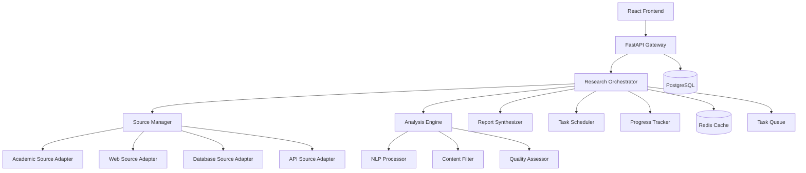

# Deep Research Agent System Design

## Overview

The Deep Research Agent System is a sophisticated AI-powered research platform that autonomously gathers, analyzes, and synthesizes information from multiple sources. The system leverages the existing FastAPI backend and React frontend architecture, extending it with specialized research capabilities, multi-source integration, and intelligent content processing.

The system follows a microservices-inspired architecture with clear separation between the research orchestration layer, source adapters, analysis engines, and presentation layer. This design ensures scalability, maintainability, and the ability to easily add new research sources and capabilities.

## Architecture

### High-Level Architecture



### Core Components

1. **Research Orchestrator**: Central coordinator that manages research workflows, task distribution, and result aggregation
2. **Source Manager**: Handles integration with multiple information sources through specialized adapters
3. **Analysis Engine**: Processes and analyzes gathered content using NLP and quality assessment
4. **Report Synthesizer**: Generates structured reports with citations and confidence scores
5. **Task Scheduler**: Manages asynchronous research tasks and resource allocation
6. **Progress Tracker**: Provides real-time updates on research progress

## Components and Interfaces

### Research Orchestrator

**Purpose**: Central coordination of research workflows and task management

**Key Responsibilities**:
- Accept and validate research requests
- Coordinate multi-source data gathering
- Manage task queuing and prioritization
- Aggregate and synthesize results
- Handle user interactions during research

**Interface**:
```python
class ResearchOrchestrator:
    async def initiate_research(self, query: ResearchQuery) -> ResearchSession
    async def get_progress(self, session_id: str) -> ProgressStatus
    async def add_focus_area(self, session_id: str, focus: str) -> bool
    async def get_preliminary_results(self, session_id: str) -> PartialReport
    async def finalize_research(self, session_id: str) -> FinalReport
```

### Source Manager

**Purpose**: Unified interface for accessing diverse information sources

**Key Responsibilities**:
- Manage source adapters and their configurations
- Handle authentication and rate limiting
- Implement fallback strategies for source failures
- Maintain source reliability metrics

**Interface**:
```python
class SourceManager:
    async def search_sources(self, query: str, source_types: List[str]) -> List[SourceResult]
    async def get_source_status(self) -> Dict[str, SourceStatus]
    def register_source_adapter(self, adapter: SourceAdapter) -> None
    async def validate_sources(self, results: List[SourceResult]) -> List[ValidatedResult]
```

### Analysis Engine

**Purpose**: Intelligent processing and analysis of gathered content

**Key Responsibilities**:
- Extract key information and themes
- Detect contradictions and conflicts
- Assess content quality and reliability
- Generate confidence scores

**Interface**:
```python
class AnalysisEngine:
    async def analyze_content(self, content: List[SourceResult]) -> AnalysisResult
    async def detect_conflicts(self, content: List[SourceResult]) -> List[Conflict]
    async def extract_themes(self, content: List[SourceResult]) -> List[Theme]
    async def assess_quality(self, content: SourceResult) -> QualityScore
```

### Report Synthesizer

**Purpose**: Generate structured, citable research reports

**Key Responsibilities**:
- Create coherent narratives from analyzed content
- Generate proper citations and attributions
- Produce confidence-scored findings
- Format reports according to user preferences

**Interface**:
```python
class ReportSynthesizer:
    async def generate_report(self, analysis: AnalysisResult, config: ReportConfig) -> Report
    async def create_citations(self, sources: List[SourceResult]) -> List[Citation]
    async def generate_executive_summary(self, findings: List[Finding]) -> Summary
    async def export_report(self, report: Report, format: str) -> bytes
```

## Data Models

### Core Research Models

```python
@dataclass
class ResearchQuery:
    query: str
    scope: ResearchScope
    time_limit: Optional[int]
    source_preferences: List[str]
    language: str = "en"
    geographic_focus: Optional[str] = None

@dataclass
class ResearchSession:
    id: str
    query: ResearchQuery
    status: SessionStatus
    created_at: datetime
    estimated_completion: datetime
    progress: float

@dataclass
class SourceResult:
    source_id: str
    source_type: str
    title: str
    content: str
    url: str
    retrieved_at: datetime
    confidence: float
    metadata: Dict[str, Any]

@dataclass
class Finding:
    content: str
    sources: List[Citation]
    confidence: float
    theme: str
    conflicts: List[str] = None

@dataclass
class Report:
    session_id: str
    executive_summary: str
    findings: List[Finding]
    citations: List[Citation]
    methodology: str
    generated_at: datetime
```

### Source Adapter Models

```python
@dataclass
class SourceAdapter:
    name: str
    source_type: str
    rate_limit: int
    authentication: AuthConfig
    reliability_score: float

@dataclass
class SearchParameters:
    query: str
    max_results: int
    date_range: Optional[DateRange]
    content_types: List[str]
    language: str
```

## Error Handling

### Error Categories

1. **Source Errors**: Handle API failures, rate limiting, authentication issues
2. **Analysis Errors**: Manage content processing failures, quality assessment errors
3. **System Errors**: Address resource constraints, database issues, queue failures
4. **User Errors**: Validate input, handle malformed queries, manage session timeouts

### Error Handling Strategy

```python
class ResearchError(Exception):
    def __init__(self, message: str, error_type: str, recoverable: bool = True):
        self.message = message
        self.error_type = error_type
        self.recoverable = recoverable

class ErrorHandler:
    async def handle_source_error(self, error: SourceError, context: ResearchContext) -> None
    async def handle_analysis_error(self, error: AnalysisError, context: ResearchContext) -> None
    async def implement_fallback_strategy(self, failed_sources: List[str]) -> List[str]
    async def notify_user_of_issues(self, session_id: str, issues: List[ResearchError]) -> None
```

### Fallback Mechanisms

- **Source Fallbacks**: Automatically switch to alternative sources when primary sources fail
- **Quality Fallbacks**: Reduce quality thresholds when high-quality sources are unavailable
- **Time Fallbacks**: Provide partial results when time constraints are exceeded
- **Scope Fallbacks**: Narrow research scope when comprehensive research is not feasible

## Testing Strategy

### Unit Testing

- **Component Testing**: Test individual components (orchestrator, source manager, analysis engine) in isolation
- **Adapter Testing**: Verify source adapters handle various response formats and error conditions
- **Analysis Testing**: Validate content processing, theme extraction, and quality assessment algorithms
- **Model Testing**: Ensure data models serialize/deserialize correctly and maintain data integrity

### Integration Testing

- **Source Integration**: Test real API connections with rate limiting and authentication
- **Workflow Testing**: Verify end-to-end research workflows with multiple sources
- **Database Integration**: Test data persistence and retrieval operations
- **Cache Integration**: Validate Redis caching behavior and cache invalidation

### Performance Testing

- **Load Testing**: Simulate multiple concurrent research sessions
- **Source Performance**: Measure response times and reliability of different sources
- **Analysis Performance**: Benchmark content processing and analysis speeds
- **Memory Testing**: Monitor memory usage during large research operations

### Quality Assurance

- **Content Quality Testing**: Validate analysis accuracy with known datasets
- **Citation Testing**: Verify citation generation and source attribution accuracy
- **Report Quality Testing**: Assess report coherence and completeness
- **User Experience Testing**: Test progress tracking and user interaction flows

### Test Data Management

- **Mock Sources**: Create mock source adapters for consistent testing
- **Test Datasets**: Maintain curated datasets for analysis algorithm validation
- **Synthetic Queries**: Generate diverse research queries for comprehensive testing
- **Performance Baselines**: Establish performance benchmarks for regression testing